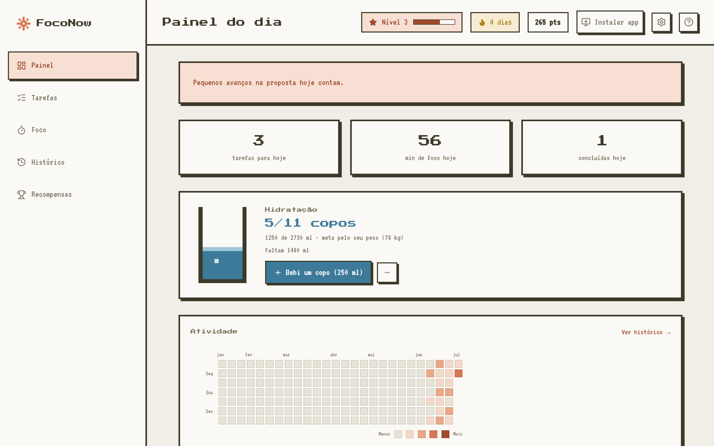
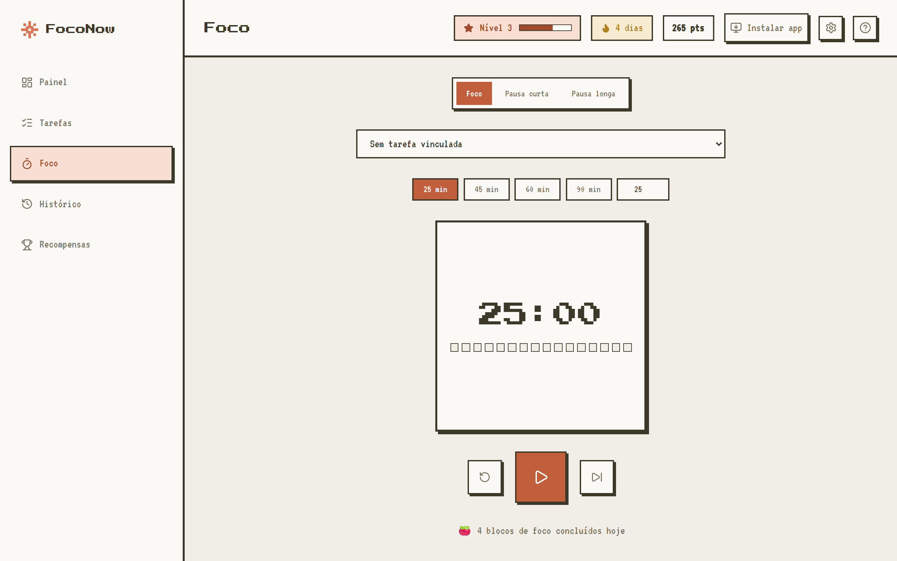
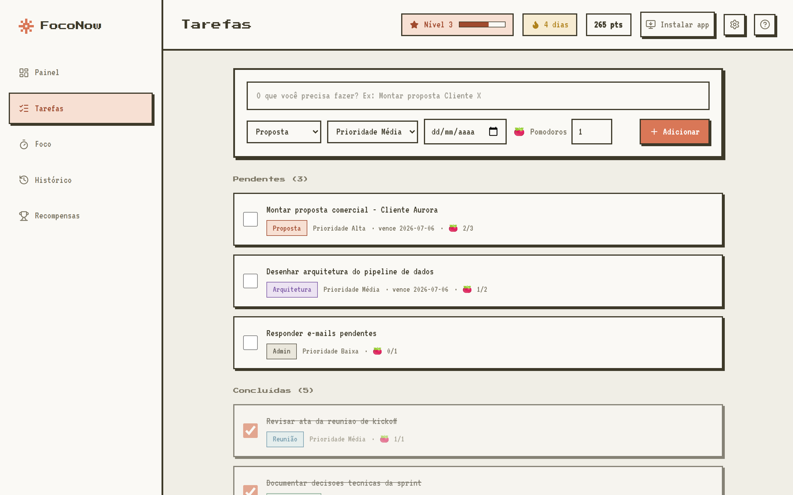

# 🍅 FocoNow

**Pomodoro + tarefas + hidratação, com visual pixel art 8-bit.**
Feito para quem vive entre reuniões e precisa proteger tempo para trabalho profundo — montar propostas, desenhar arquiteturas, escrever documentação — sem esquecer de beber água no caminho.



## ✨ O que ele faz

- **⏱️ Blocos de foco (Pomodoro)** — 25/45/60/90 min ou duração livre, vinculados a uma tarefa. Terminou no embalo? O toast oferece **+5/+10 min** para emendar sem quebrar o ritmo.
- **📋 Tarefas com contexto** — categorias (proposta, reunião, arquitetura, documentação, admin), prioridade, prazo e estimativa em pomodoros.
- **💧 Hidratação gamificada** — meta diária calculada pelo seu peso (35 ml/kg), lembretes no horário de trabalho e pontos ao bater a meta.
- **🔥 Recompensas** — pontos, níveis, streak de dias ativos e conquistas (badges) por marcos de foco, tarefas e água.
- **📊 Heatmap de atividade** — estilo GitHub, com o histórico detalhado de cada dia a um clique.
- **🔔 Lembretes inteligentes** — água a cada 45 min e um "cadê você?" se o app ficar ocioso, sempre respeitando seu horário de trabalho.
- **📱 PWA instalável** — botão "Instalar app" no header; funciona como app no desktop e no celular.
- **☁️ Seus dados na nuvem** — autenticação e armazenamento no Supabase com Row Level Security: cada usuário só acessa o que é seu.

| Bloco de foco | Tarefas |
|---|---|
|  |  |

## 🧱 Stack

- **React 19** + **TypeScript** + **Vite 8**
- **Tailwind CSS 4** (tema pixel art custom) + **Zustand**
- **Supabase** (Postgres + Auth, RLS em todas as tabelas)
- **PWA** (manifest + service worker com cache offline)
- Deploy na **Vercel**

## 🚀 Rodando o seu

### 1. Supabase (uma vez)

1. Crie um projeto em [supabase.com/dashboard](https://supabase.com/dashboard).
2. No **SQL Editor**, execute o conteúdo de [`supabase/schema.sql`](supabase/schema.sql) — cria as tabelas com as políticas de RLS.
3. Em **Project Settings → API**, copie a **Project URL** e a **publishable/anon key**.
4. (Opcional) Em **Authentication → Sign In / Up → Email**, desative "Confirm email" para cadastro instantâneo. Se mantiver ativado, configure a **Site URL** (Authentication → URL Configuration) com o domínio do app.

### 2. Local

```bash
cp .env.example .env.local   # preencha com a URL e a chave do Supabase
npm install
npm run dev
```

#### Auto-login em dev (opcional)

Para pular a tela de login durante o desenvolvimento, crie uma conta de teste
(Dashboard → Authentication → Users → **Add user**, marcando **Auto Confirm User**)
e adicione ao `.env.local`:

```bash
VITE_DEV_LOGIN_EMAIL=dev@teste.local
VITE_DEV_LOGIN_PASSWORD=uma-senha-de-teste
```

Vale só para `npm run dev` — builds de produção ignoram essas variáveis. Use uma
conta descartável (o RLS se aplica a ela como a qualquer outra), nunca sua conta real.

### 3. Vercel

1. Importe o repositório na Vercel (framework Vite é detectado sozinho).
2. Em **Settings → Environment Variables**, adicione `VITE_SUPABASE_URL` e `VITE_SUPABASE_ANON_KEY`.
3. Deploy — o [`vercel.json`](vercel.json) já cuida do rewrite de SPA, cache do service worker e headers de segurança.
4. Ajuste a **Site URL** no Supabase para o domínio da Vercel.

> A chave publishable/anon é pública por design — a segurança vem das políticas de RLS no banco. A chave `service_role` nunca deve aparecer no front.

## 📝 Notas

- O service worker (e o prompt de instalação do PWA) só atua em produção ou `npm run preview`.
- Migração: quem usava a versão antiga com dados locais (IndexedDB) tem tudo importado automaticamente para o Supabase no primeiro login.
- O dia do app segue o **fuso local** — água, streak e heatmap viram à meia-noite de verdade, não às 21h 🙂

---

Feito com 🍅 e água — e com [Claude Code](https://claude.com/claude-code) no par.
